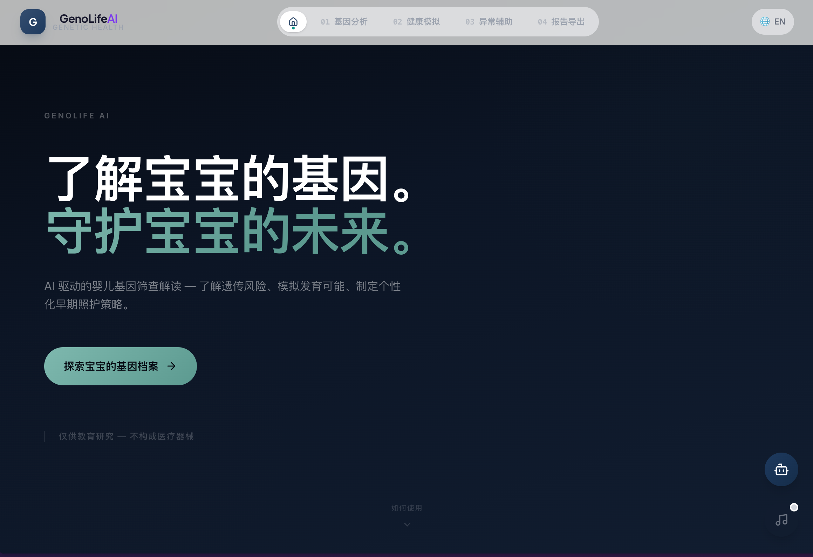

# GenoLife AI — 新生儿基因筛查智能解读平台

> 帮助0-6岁婴幼儿家长理解基因筛查结果、模拟发育可能、制定个性化早期照护策略

🏆 **AIY 黑客松 2026 深圳站** 参赛作品

🏷 命题企业 / 赛道：基因健康 · AI for Science

👤 团队：玛卡巴卡

🔢 团队编号：HD0052

---

## 👥 团队分工

| 成员 | 负责 |
|---|---|
| Zhijian Liang | 前端 UI/UX 开发、3D 可视化、i18n 国际化 |
| Shaoxi Li | 后端 API、数据库设计、VCF 解析、ClinVar 查询 |
| Yarui Xu | 模型算法、推荐引擎、基因知识库、科学验证 |

---

## ✨ 它能做什么

- **基因档案分析**：上传宝宝 VCF 基因报告，自动注释 9 个 ACMG 核心基因，解析 ClinVar 临床意义
- **基因行动地图**：根据分析结果智能匹配疾病知识库，提供分疾病的分层临床行动指引和就医问题清单
- **发育模拟**：调整喂养、睡眠、刺激、医疗依从、环境安全等早期照护因素，预测宝宝发育轨迹变化
- **健康成长中心**：基因筛查正常时，提供 AI 育儿问答、喂养/睡眠/发育/疫苗科普
- **遗传援助中心**：基因筛查异常时，提供基因解读和医疗资源指引
- **知情同意流程**：儿童基因数据双重监护人授权 — 三项勾选确认 + 二次弹窗验证，防止"一键同意"
- **隐私与伦理中心**：数据生命周期管理（7 天自动删除）、AI 安全边界（禁止训练 / 禁止诊断）、使用政策（允许 vs 禁止清单）、伦理框架
- **报告导出**：生成个性化基因健康总结，支持 Markdown / HTML / PDF 三种格式
- **3D 蛋白结构查看**：通过 Mol* 嵌入 PDB/AlphaFold 蛋白结构，直观展示基因变异位点

---

## 🎬 演示



---

## 🛠 用到的技术 / AI 工具

- **前端**：React + Vite + Framer Motion + Tailwind CSS
- **后端**：Python FastAPI + SQLAlchemy + aiosqlite
- **AI**：DeepSeek API（基因科普问答）、LangChain（推荐引擎）
- **基因注释**：ClinVar / OMIM / dbSNP 公开数据库
- **可视化**：Recharts（风险图表）、Mol*/RCSB PDB（蛋白 3D 结构）、D3.js（基因网络）
- **报告导出**：WeasyPrint（PDF）、react-markdown（Markdown 渲染）
- **科学基础**：ACMG SF v3.2 基因列表、NIH RUSP 新生儿筛查 panel、中国新生儿筛查技术规范
- **伦理合规**：ICH E18（儿科基因组研究伦理）、中国《人类遗传资源管理条例》、儿科基因检测伦理原则
- **隐私保护**：客户端本地存储优先、7 天自动数据删除、AI 模型训练禁止、商业用途禁止

---

## 🚀 怎么跑起来

### 前端

```bash
cd genolife-ai
npm install
npm run dev
```

### 后端

```bash
pip install -r requirements.txt
uvicorn backend.main:app --host 0.0.0.0 --port 8000
```

### 环境要求

- **Node.js** 18+
- **Python** 3.10+
- （可选）WeasyPrint PDF 导出需要系统依赖：macOS `brew install glib pango cairo` / Linux `apt install libpango-1.0-0 libgobject-2.0-0`

---

## 📁 项目结构

```
├── backend/              # FastAPI 后端
│   ├── api/              # 路由：profile, simulate, report, upload, analysis, ai_chat
│   ├── services/         # PRS 计算引擎、ClinVar 客户端、VCF 解析器
│   └── tests/            # 回归测试（geneCards 生成链路）
├── engine/               # G×E 交互模型 & 推荐引擎
│   └── knowledge/        # 25 基因儿科知识库 (gene_database.json)
├── genolife-ai/          # React 前端
│   └── src/
│       ├── pages/        # 8 个页面
│       │   ├── HomePage.jsx                  # 首页
│       │   ├── GeneMap.jsx                   # 基因档案分析（含知情同意）
│       │   ├── GeneticActionMap.jsx          # 基因行动地图
│       │   ├── LifeSimulation.jsx            # 发育模拟
│       │   ├── Report.jsx                    # 报告导出
│       │   ├── HealthyGrowthCenter.jsx       # 健康成长中心（结果正常）
│       │   ├── GeneticAssistanceCenter.jsx   # 遗传援助中心（结果异常）
│       │   ├── PrivacyCenter.jsx             # 隐私与伦理中心
│       │   └── EthicsReference.jsx           # 法规与伦理依据
│       ├── components/   # ConsentFlow、EthicsReminder、ScreeningSummary 等
│       └── data/         # Mock 数据 & PDB 结构映射
├── sample_vcfs/          # 6 个模拟婴儿 VCF 样本
│   ├── baby1_metabolic_star.vcf      # 代谢异常型
│   ├── baby2_multi_challenge.vcf     # 多基因挑战型
│   ├── baby3_immune_guardian.vcf     # 免疫警戒型
│   ├── baby4_neuro_focus.vcf         # 神经发育型
│   ├── baby5_cardio_watch.vcf        # 心脏关注型
│   └── baby6_healthy_all.vcf        # 全健康型
├── verify_science.py     # 科学性验证脚本
├── check_science.py      # 科学内容一致性检查
└── requirements.txt
```

---

## 📌 后续计划

- [ ] 扩展基因覆盖范围（ACMG 78 个次要发现基因）
- [ ] 接入真实新生儿筛查数据格式（串联质谱、GSP 等）
- [ ] 移动端 PWA 适配
- [ ] 医生端审核面板
- [ ] 多语言扩展（日语、韩语）
- [ ] 疾病知识库扩充（当前覆盖 9 种经典遗传病，扩展至更多罕见病）
- [ ] 本地化 ClinVar 离线注释（减少对外部 API 的依赖，提升隐私保护）

---

## 📄 版权与许可

Copyright (c) 2026 Zhijian Liang, Shaoxi Li, Yarui Xu

本作品版权归**Zhijian Liang, Shaoxi Li, Yarui Xu**共同所有，采用 [MIT License](./LICENSE) 开源，使用请署名。

> 本项目为 AIY 黑客松 2026 深圳站参赛作品，作品归团队所有；AIY 组委会仅作收录与展示。
> 
> ⚠️ 本产品仅供教育研究，不构成医疗器械，不提供临床诊断。所有 AI 生成的基因解读仅供学习参考，不得替代专业医疗建议。
